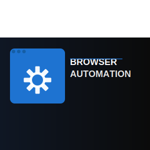

# Aura Browse - Voice Assistant Extension



Aura Browse is an AI-powered voice assistant Chrome extension that allows you to control your browser using natural voice commands. Built with React, TypeScript, and Google's Gemini AI, it provides a seamless hands-free browsing experience.

## Features

- 🎙️ Natural voice command recognition
- 🤖 AI-powered command processing using Google Gemini
- 🌐 Browser automation capabilities
- ⚡ Fast and responsive UI
- 🔒 Secure API key management
- 🎯 Accurate command execution

## Voice Commands

You can use natural language commands like:

- "Open YouTube and play Karan Aujla"
- "Search about Trump on Google"
- "Scroll down the page"
- "Click the first link"
- "Navigate to Wikipedia"

## Prerequisites

Before you begin, ensure you have the following installed:

- Node.js (v16.0.0 or higher)
- npm (v8.0.0 or higher)
- Chrome browser (v88 or higher)
- A Google Gemini API key ([Get it here](https://ai.google.dev/))

## Installation

1. Clone the repository:

```bash
git clone https://github.com/Apaarmeet/Aura-Browse.git
cd voice-assistant-extension
```

2. Install dependencies:

```bash
npm install
```

3. Build the extension:

```bash
npm run build
```

## Loading the Extension in Chrome

1. Open Chrome and navigate to `chrome://extensions/`
2. Enable "Developer mode" in the top-right corner
3. Click "Load unpacked"
4. Select the `dist` folder from your project directory

## Configuration

1. Click the extension icon in your Chrome toolbar
2. Click the settings icon (⚙️)
3. Enter your Google Gemini API key
4. Save the settings

## Development

To start the development server:

```bash
npm run dev
```

The extension will be built in watch mode, automatically recompiling when you make changes.

## Project Structure

```
├── src/
│   ├── assets/          # Static assets
│   ├── background/      # Chrome extension background scripts
│   ├── components/      # React components
│   ├── content/         # Content scripts
│   ├── types/          # TypeScript type definitions
│   └── utils/          # Utility functions
├── public/             # Public assets
└── dist/              # Built extension files
```

## Built With

- [React](https://reactjs.org/) - UI Framework
- [TypeScript](https://www.typescriptlang.org/) - Programming Language
- [Vite](https://vitejs.dev/) - Build Tool
- [Google Gemini AI](https://ai.google.dev/) - AI Command Processing
- [Chrome Extension APIs](https://developer.chrome.com/docs/extensions/reference/) - Browser Integration
- [Tailwind CSS](https://tailwindcss.com/) - Styling

## Contributing

1. Fork the repository
2. Create your feature branch (`git checkout -b feature/AmazingFeature`)
3. Commit your changes (`git commit -m 'Add some AmazingFeature'`)
4. Push to the branch (`git push origin feature/AmazingFeature`)
5. Open a Pull Request

## Permissions

The extension requires the following permissions:

- `activeTab` - To interact with the current tab
- `tabs` - To manage browser tabs
- `storage` - To store API keys and settings
- `scripting` - For content script injection
- `webNavigation` - To handle page navigation

## Privacy

- The extension only processes voice input when actively recording
- API keys are stored securely in Chrome's sync storage
- No voice data is stored or transmitted except to Google's Gemini API for processing
- All browser interactions are transparent and user-initiated

## License

This project is licensed under the MIT License - see the [LICENSE](LICENSE) file for details.

## Acknowledgments

- Google Gemini AI for natural language processing
- Chrome Extension APIs for browser integration
- Web Speech API for voice recognition

## Support

For support, please open an issue in the GitHub repository or contact the maintainers.

---

Made with ❤️ by [Apaarmeet](https://github.com/Apaarmeet)
